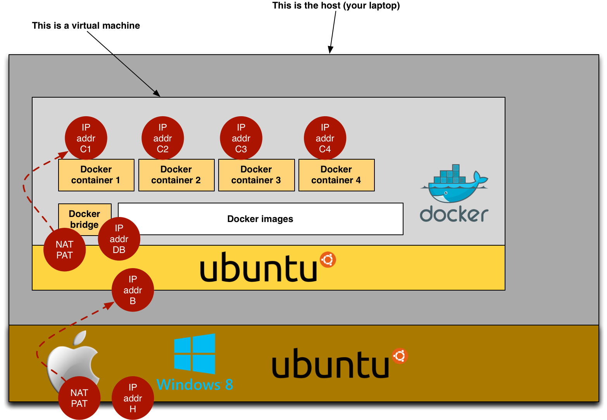

# Lab 8-9: Web Infrastructure

## Table of Contents

1. [Evaluation](#Evaluation)
1. [Phase 0: Introduction](#Phase0)
1. [Phase 1: Getting and Starting the Virtual Machine with Vagrant](#Phase1)
1. [Phase 2: Phase 2: Inspecting the Web Infrastructure with Docker](#Phase2)
1. [Phase 3: Phase 3: Playing with the infrastructure](#Phase3)
1. [Troubleshooting & FAQ](#Troubleshooting)


# <a name="Evaluation"></a>Evaluation

We will do this lab over two weeks. This week, you have to work on the questions in this document (there will be more tasks next week). You will get one grade for the overall lab. You may work in teams of two students.

**IMPORTANT NOTE:** You have to submit your answers in a forked repository (see below). Therefore, **you should NOT edit this document**. You should edit a document entitled AnswersPhase1.md in the forked repository.


### <a name="Phase0"></a>Phase 0: Introduction

Watch this [video](https://www.youtube.com/watch?v=3k95ToDYnYs) to get an introduction to the lab. You will learn about the MonSys system, which we will use as an illusration for this lab.

**Note:** as you need to download some software, you should start the phase 1 of the lab before watching the video. After typing `vagrant up`, download will start and you will have time to watch the video.


### <a name="Phase1"></a>Phase 1: Getting and Starting the Virtual Machine with Vagrant

The first thing that you have to do is to obtain a Virtual Box virtual machine and to run it. This box, running the Ubuntu linux distribution, will provide the environment to run the various nodes of the web infrastructure.

Instead of creating the virtual machine yourself and instead of using the Virtual Box GUI environment, you will use a first tool to automate a first set of tasks. This tool is called **Vagrant**. This is what Vagrant will allow you to do:

- Create your VM (called a **box**), by applying a set of configuration elements on top of a base image (I have prepared this base image and it already contains special software and configuration).

- Start, pause, stop your box from the **command line** (instead of using the Virtual Box GUI).

- Connect into your box, by doing a `vagrant ssh`. In other words, from a terminal running on your host operating system, you will be able to "jump into" the linux box. From there, you will be able to manage the web infrastructure.

- Reset/reload the configuration of your box. We will see a bit later that we use another tool, **Docker**, to run lightweight containers within the Linux box (each container corresponding to a node in the web infrastructure). You will edit Docker configuration files and content directly in your host operating system. You will do a `vagrant provision` to apply your changes to the box. This will work because I have included special instructions in the file named `Vagrantfile`.


#### Steps (preparation)

1. Make sure that you have downloaded and installed [Virtual Box](https://www.virtualbox.org/).
2. Download and install [Vagrant](http://www.vagrantup.com/downloads.html).
3. **Fork and clone** the following Github repo [https://github.com/wasadigi/Teaching-HEIGVD-RES-MonSys](https://github.com/wasadigi/Teaching-HEIGVD-RES-MonSys)
4. **Edit the Answers-Phase1.md file, add your names, commit and push**. This is very important, we will need this for doing the **grading**!
5. Open a **command line terminal**. If you are using Mac OS or Linux, you will not have any issue. If you are using Windows, you will need to use PowerShell or cygwin if you want a proper work environment.

#### Steps (setup)

Move into the `monsys-web-infra` directory

```
cd monsys-web-infra
```	

Create and launch the Linux box

```
vagrant up
```

**Paste the output of the command here:**

```
# -- YOUR ANSWER TO QUESTION 1 --

# -------------------------------
```

Your box should now be up and running. Because I have already done quite a bit of preparation work, the box already contains a running web infrastructure. The infrastructure consists of multiple nodes, with reverse proxies, web servers, etc. Each node is a Docker container.

Log into your Linux box and check what operating system it is running (the first command is executed in your host operating system, the second one in the box operating system).

```
vagrant ssh
uname -a
```

**Paste the output of the command here:**

```
# -- YOUR ANSWER TO QUESTION 2 --

# -------------------------------
```


### <a name="Phase2"></a>Phase 2: Inspecting the Web Infrastructure with Docker

Docker is a technology that allows you to create, manage and run lightweight containers on top of a Linux operating system. You can think of Docker containers as "small virtual machines running within your Virtual Box VM". As mentioned earlier, every node in the web infrastructure will be implemented as a Docker container.

You don't have to download, nor to install Docker yourself. I have already done that and when you have created your box with Vagrant, you have got a running Docker environment. As a matter of fact, you even have several Docker containers up and running within your box. You will now take a look at this ready-to-use environment.

For the following steps, you will use the `docker` command and its subcommands. Have a look the available subcommands by typing `docker` without any argument:

```
docker
```

Docker has two important concepts: **images** and **containers**. By analogy to object oriented programming, you can think of images as **classes** and of containers as **instances**. In other words, a **container** is a running instance of an **image**. It is possible to run several containers from a single image. For instance, in a web infrastructure, you would create an image with the http server software and then launch multiple containers behind a reverse proxy (which is effectively what we do in this lab).

As a first step, look at the images that I have defined with the following command:

```
docker images
```

**Paste the output of the command here:**

```
# -- YOUR ANSWER TO QUESTION 3 --

# -------------------------------
```

Once again, because I have done preparation work on the box, you already have a running web infrastructure in your hands. Not only with Docker images, but also with Docker containers in execution.

Look at the containers with the following command:

```
docker ps
```

**Paste the output of the command here:**

```
# -- YOUR ANSWER TO QUESTION 4 --

# -------------------------------
```

You can also detailed information about your containers, with the `docker inspect` and `docker top` sub-commands. The first one gives you a lot of information, **including the private IP address that has been assigned to the container**. The second one gives you a list of running processes within the container.

**Answer the following question: what is the IP address assigned to each Docker container running in your box?**

```
# -- YOUR ANSWER TO QUESTION 5 --

# -------------------------------
```

[](images/diagram.png)


Have a look at the [Docker documentation](http://docs.docker.io/use/networking/) on the topic, which states:

> Docker uses Linux bridge capabilities to provide network connectivity to containers. The docker0 bridge interface is managed by Docker for this purpose. When the Docker daemon starts it :

> - creates the docker0 bridge if not present
> - searches for an IP address range which doesn't overlap with an existing route
> - picks an IP in the selected range
> - assigns this IP to the docker0 bridge

Replace the placeholders (H, B, DB, C1, C2, C3, C4, PB1, PB2, PB3, PB4, PC1, PC2, PC3, PC4) with the values that you observe in your environment. Look at the content of `Vagrantfile` to see how port forwarding has been configured for the box. Use `docker container` and `docker inspect` to see how port forwarding has been configured for the Docker environment.


```
# -- YOUR ANSWER TO QUESTION 6 --

Host (your laptop):
- IP address: H.H.H.H

Virtual Machine run by Virtual Box
- IP address: B.B.B.B
- PAT: packets arriving on H.H.H.H:PH are forwarded to B.B.B.B:PB

Docker Bridge
- IP address: DB.DB.DB.DB
- PAT: packets arriving on DB.DB.DB.DB:PB1 are forwarded to C1.C1.C1.C1:PC1
- PAT: packets arriving on DB.DB.DB.DB:PB2 are forwarded to C2.C2.C2.C2:PC2
- PAT: packets arriving on DB.DB.DB.DB:PB3 are forwarded to C3.C3.C3.C3:PC3
- PAT: packets arriving on DB.DB.DB.DB:PB4 are forwarded to C4.C4.C4.C4:PC4

Docker Container 1
- IP address: C1.C1.C1.C1

Docker Container 2
- IP address: C2.C2.C2.C2

Docker Container 3
- IP address: C3.C3.C3.C3

Docker Container 4
- IP address: C4.C4.C4.C4

# -------------------------------
```

### <a name="Phase3"></a>Phase 3: Playing with the infrastructure

By now, you should have a running web infrastructure within your box, with 1 reverse proxy, 2 web servers and 1 app server. Go through the following steps to check that everything is working and that you can "talk HTTP" with the components (use `telnet` to establish connections with the various nodes and type HTTP requests).

* Make sure that you can display the MonSys UI in your browser. You should type `http:www.monsys.com:9090` in your browser. But for this to work, your host (i.e. your laptop OS) should know how to translate `www.monsys.com` into a valid IP address. You can do that by adding an entry in the `/etc/hosts` file (on unix systems). If you are on Windows, have a look at [this page](http://www.jafaloo.com/windows-hosts-file/).

* From your host OS, open a terminal, establish a direct connection to the reverse proxy node. Send an HTTP request to retrieve the HTML page of the MonSys UI (it will be sent back by the apache httpd server).

```
# -- YOUR ANSWER TO QUESTION 7 --

Which command did you type on the terminal to establish the connection?

What HTTP request did you type and send?

What HTTP response did you get?
# -------------------------------
```

* From your host OS, open a terminal, establish a direct connection to the reverse proxy node. Send an HTTP requests to retrieve the AJAX payload (it will be generated by the Node.js server).

```
# -- YOUR ANSWER TO QUESTION 8 --

Which command did you type on the terminal to establish the connection?

What HTTP request did you type and send?

What HTTP response did you get?
# -------------------------------
```


### <a name="Phase4"></a>Phase 4: Adding a New Web Site in the Infrastructure

In this phase, you will extend the infrastructure to **deploy a new web site**. At the end of the lab, if you have done everything correctly, you should be able to see [this](images/this.png) and [that](images/that.png) on your laptop. Look carefully at the full URLs in the navigation bar (and notice that we use the  port number 8014, and not 9090 as in the previous phases). 

> **HINT 1:** I have mapped both the the DNS names to the IP address of the virtual machine (192.168.33.20, as defined in `Vagrantfile`).

>**HINT 2:** I have changed the port mapping for the `rp-node` container in `Vagrantfile`.

Here are the detailed requirements:

1. You want to have **3 equivalent nodes**, behind the HTTP reverse proxy, to publish your web content. The raw content that you need for your web site is provided [here](https://github.com/wasadigi/Teaching-HEIGVD-RES-MonSys/tree/master/raw-content-clash-of-classes) (it has been flattened, so you will need to move the files in the right directory structure).

2. On these nodes, you want to use the **apache httpd daemon** both to server static content (html documents, images, etc.).

3. Users will access two types of URLs, starting with the following prefixes: `http://live.clashofclasses.ch` and `http://leaderboard.clashofclasses.ch`. Again, be aware that we want to use the standard HTTP port in these URLs.

4. Your 3 nodes should be accessed **via the existing reverse proxy**. Hence, you will need to **modify the configuration** of this component.

5. To achieve the objectives, you will need to do updates in the **Vagrant** and **Docker** configuration files.

#### Step 1: Prepare content for new Docker containers and update the Vagrant file

In the `monsys-web-infra` directory, you need to consider two elements:

- The first one is the `Vagrantfile`, which specifies what needs to be done when the vagrant box (i.e. the virtual machine run by Virtual Box) is provisioned.

- The second one is the `docker` directory, which contains one directory for each type of node.

**You should use the existing configuration as a basis and make adjustments to meet the above requirements:**

- Since you want to use apache on your three nodes, you should **clone** the `monsys-web-infra/docker/web-apache` directory (into a new one called `monsys-web-infra/docker/web-clash`). The directory contains both the **content** and the **configuration** files for the web site. the `Dockerfile` specifies where to copy these files (in the container file system). Look at the `ADD` directives for that.

- In the `Vagrant file`, you should update three different sections. 
  - In the first one, you should make sure that your 3 containers are stopped and removed at provisioning time (look at the `$script` variable). 
  - In the second one, you should build a new image that will serve as a basis for your 3 containers (look for the `d.build_image` directive). 
  - Finally, in the third one, you should run 3 containers using your own image as a basis (look for the `d.run` directive). You should add your configuration at the end of the `config.vm.provision "docker" do |d|` block, to make sure that your containers are started after the existing ones (*without going into details, this will avoid issues with IP addresses that are currently managed in a static, sub-optimal way; in other words, in the reverse proxy configuration, I expect the web-nodes to have particular IP addresses but I let Docker assign these addresses - hoping for the best...*).

- You can do a first test by simply cloning the `web-apache` directory, updating the `Vagrantfile` file and doing a `vagrant provision`. When you are done, do a `vagrant ssh` and a `docker ps` (or a `docker ps -a`) to check that your 3 containers are properly running.

#### Step 2: Prepare the web content

- Once you have validated that you are able to create new Docker images and to run corresponding Docker containers, you can move to next step and prepare the content for your two web sites.

- You will create **two virtual hosts**. This means that you will setup two root folders on your Docker container image (the same image is used to run both virtual hosts).

- Use the provided content (HTML, CSS and JPG files) and place it in the appropriate directory structure. In some cases, you should change the name of the files (e.g. the HTML files). You should not have to change the content of the file.


#### Step 3: Update the apache httpd configuration

- You should create **one configuration file for each of the two virtual hosts**. Again, look at it was done for the existing infrastructure. **Be aware that apache httpd will load files if they end with the `.conf` suffix**.

#### Step 4: Test and validate your web containers

- At this point, you need to test and validate your setup. You may not yet be able to access your containers from a browser running on your host operating system, but that should not prevent you from sending hand-crafted HTTP requests from your VM to your containers. Remember that you can use `docker inspect` to get information about containers, including their IP address.

- Describe in details the procedure you have followed to activate, test and validate your configuration. Provide the list of commands you have typed and the output of these commands. If you have encountered issues, then describe them and explain how you have solved them. Make sure to test that the two virtual hosts are working as expected!

```
# -- YOUR ANSWER TO QUESTION 9 --

What procedure did you follow to validate the configuration of 
your new web nodes? 

Provide details and evidence (command results, etc.) that your 
setup is correct.
# -------------------------------
```

#### Step 5: Update the nginx reverse proxy configuration

- Assuming that your 3 web containers up and running, you still have to configure the reverse proxy to implement the **forwarding** and **load balancing** of HTTP requests targeting your virtual hosts. You will do this by editing the configuration files of the `rp-nginx` node (look for the `default` file under the `etc` sub-tree).

- Remember that you must first **define a pool of nodes** (such a pool is defined for the two web nodes in the original infrastructure), and then define the **forwarding rules**.

- To apply your changes, you will do yet another `vagrant provision`. Make sure to do a `docker ps` after that. Indeed, if you have made mistakes in your configuration files, the nginx daemon may refuse to start. You would then see a missing container when doing the `docker ps`. Doing a `docker ps -a` and a `docker logs` will allow you to start the troubleshooting process.


#### Step 6: Test and validate of the updated infrastructure

- When you believe that your infrastructure has been fully configured and is working, you will need to specify a validation procedure. Your two virtual hosts should be accessible via  [`http://live.clashofclasses.ch`](http://live.clashofclasses.ch) and [`http://dashboard.clashofclasses.ch`](http://dashboard.clashofclasses.ch).

- Don't forget to change your local DNS configuration, so that `live.clashofclasses.ch` and `live.clashofclasses.ch` are resolved to the IP address of the virtual machine (this IP is defined in `Vagrantfile`).

```
# -- YOUR ANSWER TO QUESTION 10 --

What procedure did you follow to validate the configuration of 
your complete infrastructure?

Provide details and evidence (command results, etc.) that your 
setup is correct.

# -------------------------------
```


## <a name="Troubleshooting"></a>Troubleshooting & FAQ

**1. Docker seems to be stuck and does not respond**

**Question:** I am trying to do a `vagrant provision`, to apply modifications to my Docker environment, but the process seems to be stuck. I don't see any output on the terminal, even after a couple of minutes.

**Answer:** restart and provision the box with the following command:

```
vagrant halt
vagrant up
vagrant provision
```

When you are troubleshooting this type of issue, make sure to run `docker ps` and `docker ps -a` commands on a regular basis. When you look at the output of these commands, check that the containers are running. Also, check that there is something in the `PORTS` column of the output of `docker ps`. If that is not the case, then there is an issue with Docker. Try to do a `sudo service docker stop` followed by a `sudo service docker start` and check again.

**2. A Docker container seems to have disappeared**

**Question:** In the initial setup, I had 4 Docker containers. After doing some configuration changes and pushing them with a `vagrant provision`, I cannot send HTTP requests anymore. When I do a `docker ps`, I now see less than 4 containers…

**Answer:** When Docker starts a container, it invokes a command. If there is a problem during the execution of this command (for instance, because of an error in the config file used by the command), then the container exits. Start by listing **all** containers (the running and the stopped ones) with the following command:

```
docker ps -a
```

After confirming that the container has a status of "Exited", use the following command to get information about the problem (replace CONTAINER_NAME with the name of the container):

```
docker logs CONTAINER_NAME
```

---
**3. How do I log into my container?**

**Question:** I want to explore the file system of my container, to see where configuration files are located, etc. How do I do that?

**Answer:** The recommended way to use Docker is to run a single service in every container (an apache httpd service, a mysql service, a sshd service, etc.). For this reason, many containers do not run a sshd daemon and it is not possible to ssh into a running container.

It is possible to launch a new container from the same image and, instead of executing the standard command (e.g. the apache2 daemon), to start a shell. A command of this form will allow you to do that (`heig/web-apache` is the name of the image):

```
docker run -i -t --entrypoint='/bin/bash' heig/web-apache -i
```

---

**4. How do I clean up exited containers?**

**Question:** After a while, I have a number of containers in Exited status which I don't plan to restart. I see them with a `docker ps -a`. I could do a `docker rm` one by one, but that would be long and boring. Can I remove all these containers with a single command?

**Answer:** Here is how you can do it (from [source](https://coderwall.com/p/zguz_w)):

```
sudo docker ps -a | grep Exit | cut -d ' ' -f 1 | xargs sudo docker rm
```

